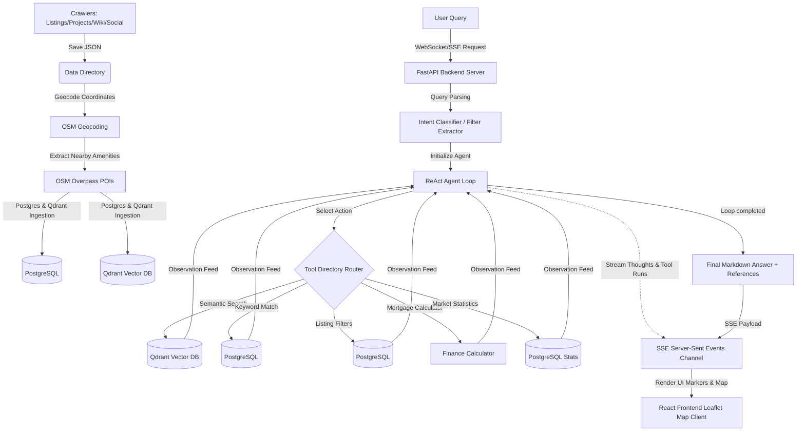

# 🏠 Real Estate AI Assistant

An intelligent, Vietnamese-language real estate assistant featuring a **data crawling engine**, a **PostgreSQL + Qdrant RAG ingestion pipeline**, and a **ReAct (Reasoning & Action) Agent** served via **FastAPI** to an interactive **React + Leaflet Map** dashboard.

---

## 🗺️ System Architecture

The following diagram illustrates the flow of data from raw crawling, spatial enrichment, ingestion, agentic tool execution, and the SSE streaming frontend:



---

## 🛠️ Technology Stack

- **Crawling Engine:** Python 3.10+, BeautifulSoup, Playwright (async JS rendering), OpenStreetMap Overpass API, YouTube Data API.
- **Database Layer:**
  - **PostgreSQL:** Relational listings, project specs, news archives, and global Point of Interest (POI) databases.
  - **Qdrant Vector DB:** Multilingual vector store indexing dense text embeddings from `sentence-transformers/paraphrase-multilingual-MiniLM-L12-v2`.
- **RAG Backend:** FastAPI, Pydantic, Ollama (`qwen2.5:7b` local agent) or Google Gemini API.
- **Frontend Dashboard:** React 18, Vite, Leaflet Maps, Vanilla CSS, Server-Sent Events (SSE).

---

## 🚀 Installation and Setup

### 1. Prerequisites
Ensure you have Python 3.10+, Node.js (v18+), and Docker installed on your host OS.

### 2. Environment Configuration
Create a `.env` file in the project root:

```ini
# Crawlers API Keys
YOUTUBE_API_KEY=your_youtube_v3_api_key
REQUEST_DELAY=1.0

# LLM Selection: "gemini" or "ollama"
LLM_PROVIDER=ollama
OLLAMA_MODEL=qwen2.5:7b
OLLAMA_BASE_URL=http://localhost:11434

# Or if using Gemini API:
# LLM_PROVIDER=gemini
# GEMINI_API_KEY=your_gemini_key
# GEMINI_MODEL=gemini-2.0-flash-lite

# PostgreSQL Database Connections
POSTGRES_HOST=localhost
POSTGRES_PORT=5432
POSTGRES_DB=real_estate
POSTGRES_USER=postgres
POSTGRES_PASSWORD=postgres

# Qdrant Vector DB Connections
QDRANT_HOST=localhost
QDRANT_PORT=6333
```

### 3. Setup Python Backend
```bash
# Create and activate virtual environment
python -m venv .venv
source .venv/bin/activate

# Install requirements
pip install -r requirements.txt
python -m playwright install chromium
```

### 4. Setup Databases
Spin up PostgreSQL and Qdrant instances using the provided Docker Compose configuration:
```bash
docker-compose up -d
```

### 5. Setup React Frontend
```bash
cd frontend
npm install
npm run build # Pre-builds assets for FastAPI static hosting
cd ..
```

---

## 📥 Data Crawling & Ingestion Workflow

To populate the assistant with real estate datasets, follow this workflow:

### Step 1: Crawl Primary Listings and Projects
Run the crawling engine to retrieve active listings (sale/rent) and residential project reviews:
```bash
python crawlers/run.py --type ban --pages 5
python crawlers/run.py --type cho-thue --pages 5
python crawlers/run.py --type du-an --pages 3
```

### Step 2: Ingest Knowledge/News Base
Scrape market articles and real-estate wiki guidelines:
```bash
python crawlers/run.py --type tin-tuc --pages 3
python crawlers/run.py --type wiki --pages 3
```

### Step 3: Spatial Geocoding
Convert textual address fields into exact latitude/longitude coordinates using OpenStreetMap Nominatim:
```bash
python crawlers/run.py --type geocode --geocode-limit 0
```

### Step 4: Spatial Amenity Enrichment (OSM POIs)
Map nearby points of interest (schools, parks, hospitals, shopping malls) within 2 km of every geocoded address:
```bash
python crawlers/run.py --type osm-poi
```

### Step 5: Social Media Relevance Ingestion
Crawl Voz discussions, YouTube transcripts, and TikTok neighborhood reviews using geocoded listing titles as search query contexts:
```bash
python crawlers/run.py --type youtube --pages 3
python crawlers/run.py --type tiktok --pages 3
python crawlers/run.py --type voz --pages 3
```

### Step 6: Load DB & Vector Store Ingestions
Run the global ingestion engine to chunk documents, generate vectors, populate the relational databases, and build the Qdrant indexing:
```bash
python -m db.ingest --source all
```

---

## 🤖 ReAct Agent & Custom Tools

The pipeline implements an agentic **ReAct loop** (Reasoning and Action) that handles complex/compound user inputs. The LLM acts as the central router and has access to 5 deterministic backend tools:

### Tool Index

1. **`semantic_search` (Qdrant Vector DB):**
   - *Purpose:* Searches semantic contexts (e.g., articles, social discussions, neighborhood reviews).
   - *Parameters:* `query_text` (str), `collections` (list of strings), `limit` (int).
2. **`keyword_search` (PostgreSQL `ILIKE` Matches):**
   - *Purpose:* Locates precise names, project codes, or explicit phrases in listing titles.
   - *Parameters:* `query_text` (str), `collections` (list of strings), `limit` (int).
3. **`filter_listings` (PostgreSQL DB Filters):**
   - *Purpose:* Retrieves list of properties matching strict structured filters (price limits, district, city, bedrooms, property types).
   - *Parameters:* `price_max_trieu` (float), `price_min_trieu` (float), `bedrooms` (int), `tinh_thanh` (str), `quan_huyen` (str), `property_type` (str).
4. **`calculate_loan` (Mortgage & Finance Calculator):**
   - *Purpose:* Computes exact principal loan plans, monthly interest schedules, and alternative interest scenario comparisons.
   - *Parameters:* `property_price_trieu` (float), `down_payment_pct` (float), `annual_rate_pct` (float), `term_years` (int).
5. **`get_market_statistics` (Aggregated District Snapshots):**
   - *Purpose:* Computes average prices, average square-meter costs, and total active tin-đăng counts inside a location.
   - *Parameters:* `tinh_thanh` (str), `quan_huyen` (str).

### Compound Intent Resolution Example
If the user asks:
> *"Tôi muốn tìm chung cư giá khoảng 5 tỷ ở Quận 2 có 2 phòng ngủ và muốn tính lãi suất vay mua nhà trong 15 năm"*

The agent executes:
1. `filter_listings` (with filters: max price 5B, 2 bedrooms, district 2).
2. Parses the returned listings (e.g. *Victoria Village for 4.9B VND*).
3. Executes `calculate_loan` (with property price 4.9B VND, term 15 years).
4. Synthesizes a unified response: listings with descriptions/URLs, precise financial parameters, monthly amortization amounts, and interest scenarios.

---

## 🖥️ Running the Application

### 1. Launch FastAPI Server
Run the FastAPI web backend:
```bash
PYTHONPATH=. .venv/bin/python -u web/server.py
```
This loads the embeddings engine and verifies backend DB dependencies before starting the API server on `http://127.0.0.1:8000`.

### 2. Access Web Client Interface
Open your browser and navigate to `http://localhost:8000`.
- **Chat Panel:** Stream agent thinking tracks (*[Suy nghĩ: ...]* and *🔧 Thực hiện công cụ: ...*) dynamically alongside final Markdown responses.
- **Interactive Map:** Markers representing listings retrieved by the agent are pinned automatically on the Leaflet map panel.
- **Mortgage Calculator Tab:** Perform standalone calculations on the sidebar to compare interest amortizations and verify affordability.

---

## 🧹 Code Clean-up Logs

To keep the workspace clean and maintainable, all unused, legacy static frontend files (`web/index.html`, `web/app.js`, `web/styles.css`) have been removed from the repository. The application is served purely from the React Vite bundle compiled under the `frontend/dist` directory.
