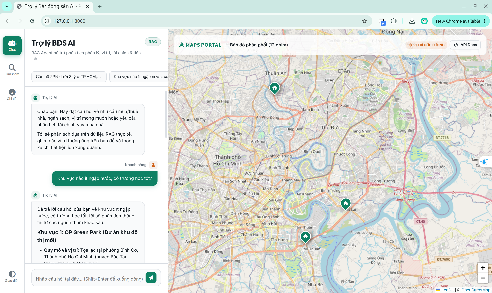
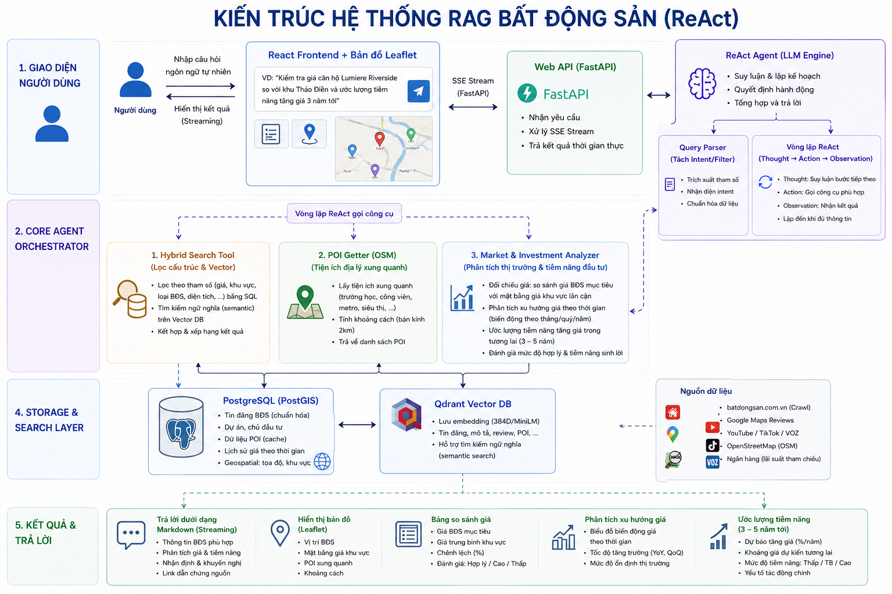

# 🏠 Real Estate AI Assistant

An intelligent, Vietnamese-language real estate assistant featuring a **data crawling engine**, a **PostgreSQL + Qdrant RAG ingestion pipeline**, and a **ReAct (Reasoning & Action) Agent** served via **FastAPI** to an interactive **React + Leaflet Map** dashboard.



---

## 🗺️ System Introduction & Architecture

The assistant implements a multi-layered **Agentic RAG pipeline** driven by a **ReAct** (Reasoning and Action) loop. The core agent orchestrates user requests by parsing intents, checking structured property filters, performing hybrid searches (PostgreSQL metadata + Qdrant dense vector embeddings), and calling custom tools.

**Key Capabilities:**
- **Scientific Market Trend Analysis**: Evaluates historical median price trends (grouped by month) across neighborhoods to advise if a property price is reasonable and if it has investment potential.
- **Dynamic Geospatial Search**: Agents can dynamically query OpenStreetMap (Nominatim) at runtime to find nearby schools, hospitals, and amenities without pre-crawling.
- **Side-by-Side Comparison**: The interactive dashboard allows users to select two properties, open a visual comparison modal, and automatically prompt the AI to deeply compare their pros and cons.
- **Social Listening**: RAG grounding based on data scraped from Batdongsan, YouTube reviews, TikTok comments, and Voz forum discussions to provide "real-world" sentiment and flood/traffic warnings.



### 🛠️ Technology Stack
- **AI Agent Framework:** ReAct loop implemented in Python, integrated with local LLMs (via Ollama Qwen2.5) or Google Gemini API.
- **Data & Embedding Layer:** PostgreSQL (structured metadata & market aggregations) and Qdrant (dense vectors with `paraphrase-multilingual-MiniLM-L12-v2`).
- **Web App & UI:** FastAPI (backend with SSE streaming) and React + Vite (frontend interactive dashboard).

---

## 🚀 Environment Setup

### 1. Prerequisites
Ensure you have **Python 3.10+**, **Node.js (v18+)**, and **Docker** installed.

### 2. Configure Environment Variables
Create a `.env` file in the project root:
```ini
# Crawlers
YOUTUBE_API_KEY=your_youtube_api_key_here
REQUEST_DELAY=1.0

# LLM Provider selection: "vertexai", "gemini", or "ollama"
LLM_PROVIDER=vertexai

# Chat model (optional, default: gemini-2.5-flash-lite)
PROJECT_ID=your_gcp_project_id
GEMINI_MODEL=gemini-2.5-flash-lite
# GEMINI_API_KEY=your_gemini_key (If LLM_PROVIDER=gemini)

# If using Ollama:
OLLAMA_MODEL=qwen2.5:7b
OLLAMA_BASE_URL=http://localhost:11434

# PostgreSQL
POSTGRES_HOST=localhost
POSTGRES_PORT=5432
POSTGRES_DB=real_estate
POSTGRES_USER=postgres
POSTGRES_PASSWORD=postgres

# Qdrant
QDRANT_HOST=localhost
QDRANT_PORT=6333

# Web Search API (Tavily)
TAVILY_API=your_tavily_api_key_here
```

---

## 🐋 Docker Compose (Databases)

Start PostgreSQL and Qdrant in the background via Docker Compose:
```bash
docker compose up -d
```
*(Note: If you run into issues, try `docker-compose up -d` depending on your Docker version).*

---

## 📦 Install Dependencies

Install Python backend dependencies:
```bash
python -m venv .venv
source .venv/bin/activate
pip install -r requirements.txt
python -m playwright install chromium
```

Build the React frontend assets:
```bash
cd frontend
npm install
npm run build
cd ..
```

---

## 📥 Crawl Data & Ingestion

Before running the chatbot, populate the databases with crawled real estate data. The offline crawler pulls listings, news, and social media data. OpenStreetMap data is not pre-crawled; the agent will search it dynamically during chats!

> **⚠️ Note on Social Crawling Requirements**: 
> 1. **TikTok**: You must provide a valid `cookies.txt` file (Netscape format) in the project root to bypass anti-bot challenges.
> 2. **YouTube**: You must configure `YOUTUBE_API_KEY` in your `.env` file to successfully fetch video transcripts and comments.

```bash
# 1. Crawl active property listings & project profiles
python crawlers/run.py --type ban --pages 5
python crawlers/run.py --type cho-thue --pages 5
python crawlers/run.py --type du-an --pages 3

# 2. Scrape news articles and guidelines
python crawlers/run.py --type tin-tuc --pages 3
python crawlers/run.py --type wiki --pages 3

# 3. Crawl social media reviews (YouTube, Voz, TikTok)
python crawlers/run.py --type youtube --pages 3
python crawlers/run.py --type voz --pages 3
python crawlers/run.py --type tiktok --pages 3

# 4. Alternatively, crawl absolutely everything at once!
# python crawlers/run.py --type all --pages 3

# 5. Index the crawled datasets into PostgreSQL and Qdrant DB
python -m db.ingest --source all
```

---

## 🖥️ Run the System

Once your database is populated, launch the FastAPI web server from the project root:
```bash
PYTHONPATH=. .venv/bin/python -u web/server.py
```
Open your browser and navigate to `http://localhost:8000` to interact with the assistant!

### UI Features:
*   **Chat Panel:** Watch the Agent stream its reasoning thoughts, tool execution tracks, and final markdown answers dynamically.
*   **Resizable Panel:** Drag the right border of the chat panel to extend it horizontally for comfortable reading.
*   **Interactive Map:** Explore property pins dynamically plotted on the Leaflet map client as the chatbot suggests them.
*   **Compare Properties:** Check "Thêm vào so sánh" on two listings to launch the side-by-side modal and trigger an automated deep AI comparative analysis.
